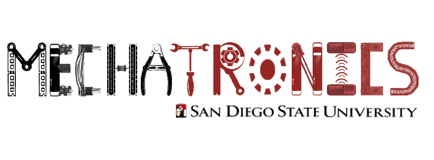

.. SDSU Mechatronics Club: RoboSub 2015 Software Engineering documentation master file, created by
   sphinx-quickstart on Thu Jul 30 14:35:38 2015.
   You can adapt this file completely to your liking, but it should at least
   contain the root `toctree` directive.

===================================================================================
Welcome to SDSU Mechatronics Club: RoboSub 2015 Software Engineering Documentation!
===================================================================================

-------
Content
-------
.. toctree::
   _launch_gui_.rst
   _send_joystick_data_.rst
   blinky.rst
   data_logger.rst
   dvl_ahrs_dummy.rst
   dvl_test.rst
   utilities.rst
   waypoint_plot.rst
   

Indices and tables
==================

* :ref:`genindex`
* :ref:`modindex`
* :ref:`search`

